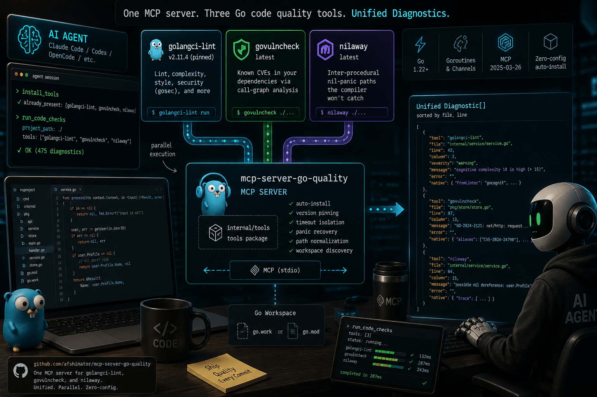

# mcp-server-go-quality

**One MCP server for golangci-lint, govulncheck, and nilaway — a unified `Diagnostic[]` array with consistent file:line:column navigation, parallel execution, and zero-config auto-install.**

---

[](https://github.com/afshinator/mcp-server-go-quality/actions/workflows/test.yml)
[](https://goreportcard.com/report/github.com/afshinator/mcp-server-go-quality)
[](https://pkg.go.dev/github.com/afshinator/mcp-server-go-quality)
[]()
[](LICENSE)

---

## Demo


---

## What it does

Wraps three Go code quality tools into a single MCP interface. Designed for **AI coding agents** (Claude Code, Codex, OpenCode) but also useful for CI pipelines and local development. Call one tool (`run_code_checks`) and get a flat, sorted `Diagnostic[]` array — all three checkers run in parallel under independent timeouts. Tools auto-install on first use.

| Concern | Raw CLI | This server |
|---|---|---|
| Entry points | 3 separate `go install` + invocation | 1 MCP tool call |
| Output format | 3 incompatible schemas | 1 unified `Diagnostic[]` array |
| Tool install | Manual per machine | Auto-install with version pinning |
| Concurrency | Sequential by default | Parallel goroutines, per-tool timeouts |
| Error handling | Parse exit codes and stderr manually | Canonical `error` field per diagnostic, panic recovery |
| Path normalization | Raw absolute paths | Relative to project root |
| Workspace support | Manual `go.work` parsing | Two-pass root discovery (`go.work` > `go.mod`) |

---

## Tools bundled

| Tool | Version | Checks |
|---|---|---|
| [golangci-lint](https://golangci-lint.run) | **v2.11.4** (pinned) | Lint violations, complexity (`gocyclo`/`gocognit`), security (`gosec`) |
| [govulncheck](https://pkg.go.dev/golang.org/x/vuln/cmd/govulncheck) | latest | Known CVEs reachable from your code via call-graph analysis |
| [nilaway](https://github.com/uber-go/nilaway) | latest | Inter-procedural nil-panic paths the compiler won't catch |

---

## MCP tools exposed

| Tool | Description |
|---|---|
| `run_code_checks` | Run all 3 checkers in parallel (or a subset via `tools` param). Returns sorted `Diagnostic[]`. |
| `run_lint` | Run golangci-lint only. |
| `run_vuln_check` | Run govulncheck only. |
| `run_nil_check` | Run nilaway only. |
| `install_tools` | Pre-install all three tools with pinned/latest versions. Call this at session start. |

---

## Output schema

Every tool returns a flat array of this shape, sorted by `file` then `line`:

```json
[
  {
    "tool": "golangci-lint",
    "file": "cmd/main.go",
    "line": 115,
    "column": 1,
    "severity": "warning",
    "message": "cognitive complexity 18 is high (> 15)",
    "error": "",
    "native": {"FromLinter": "gocognit", "Text": "...", "SuggestedFixes": [...]}
  }
]
```

| Field | Notes |
|---|---|
| `severity` | Absent (not `""`) for govulncheck and nilaway — they have no severity concept |
| `native` | Full raw tool output. `null` for error diagnostics that carry no raw context. Govulncheck parse errors carry raw error strings as a JSON array. |
| `error` | Non-empty on tool failure or panic. **Check this first** before reading `file`/`line`. |

---

## Installation

### For AI agents (Claude Code, etc.)

```bash
claude mcp add go-quality -- go run github.com/afshinator/mcp-server-go-quality/cmd/mcp-server-go-quality@latest
```

For other MCP clients, add to your config:

```json
{
  "mcpServers": {
    "go-quality": {
      "command": "mcp-server-go-quality",
      "args": []
    }
  }
}
```

### For humans (local install)

```bash
go install github.com/afshinator/mcp-server-go-quality/cmd/mcp-server-go-quality@latest
```

Then run it directly on a Go project:

```bash
cd ~/my-go-project
mcp-server-go-quality
# Or specify a project path and config:
mcp-server-go-quality --config ./my-config.yaml
```

The server starts in stdio mode — connect any MCP client or test it interactively by piping JSON-RPC. Tools auto-install into `$GOBIN` on first use.

**Prerequisites:** Go 1.22+ on `PATH`.

---

## Agent workflow

1. **Install tools** — call `install_tools` at session start. Returns `installed`, `already_present`, and `failed` lists. A fast no-op if binaries are at the correct version.
2. **Run checks** — call `run_code_checks` with `project_path` set to the project root (or any subdirectory — the server walks up to `go.work` or `go.mod`).
3. **Process diagnostics** — check `error` first (non-empty = tool failure), then navigate to `file:line:column`. The `native` field carries full raw output for remediation.

Full contract and processing loop: **[docs/agents/AGENTS.md](docs/agents/AGENTS.md)**  
Error tables, remediation, and troubleshooting: **[docs/agents/reference.md](docs/agents/reference.md)**

---

## Configuration (`.go-quality.yaml`)

Place at the project root. All fields optional.

```yaml
timeout: 5m          # per-tool deadline; increase for big monorepos or first vuln DB download

tools:
  golangci-lint:
    version: v2.11.4
    extra_args: []
  govulncheck:
    version: latest
    extra_args: []
  nilaway:
    version: latest
    extra_args: ["--exclude-pkgs=github.com/myorg/vendor"]
```

Precedence: `--config` flag > `.go-quality.yaml` at server CWD > compiled-in defaults.

---

## Go workspace support

Supports single-module `go.mod` and `go.work` multi-module workspaces. Pass any subdirectory as `project_path` — the server walks up to find `go.work` first, then `go.mod`. Nilaway automatically collects module paths from `use` directives and passes them via `-include-pkgs`.

---

## Contributing

TDD enforced — nearly every source file has a companion `_test.go` file. Integration tests run against [`testdata/sample_project/`](testdata/sample_project/), a small Go module with intentional issues for all three tools.

```bash
make test       # unit tests (fast)
make test-all   # full suite including integration
make lint       # golangci-lint
make fmt        # gofumpt + goimports
make build      # compile the binary
```

---

MIT License
